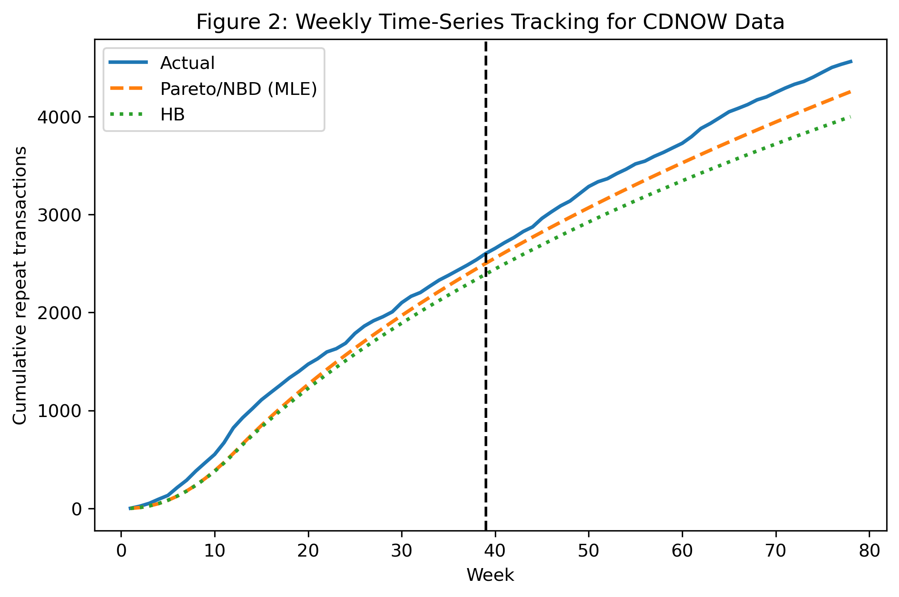
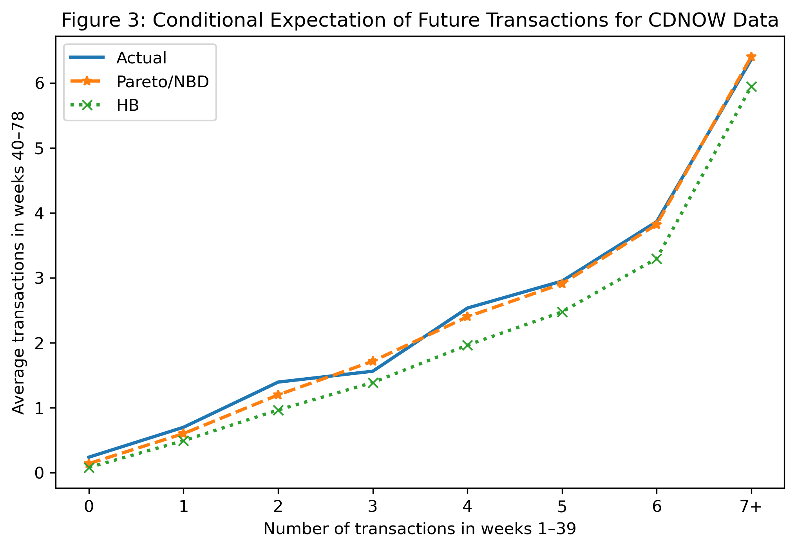
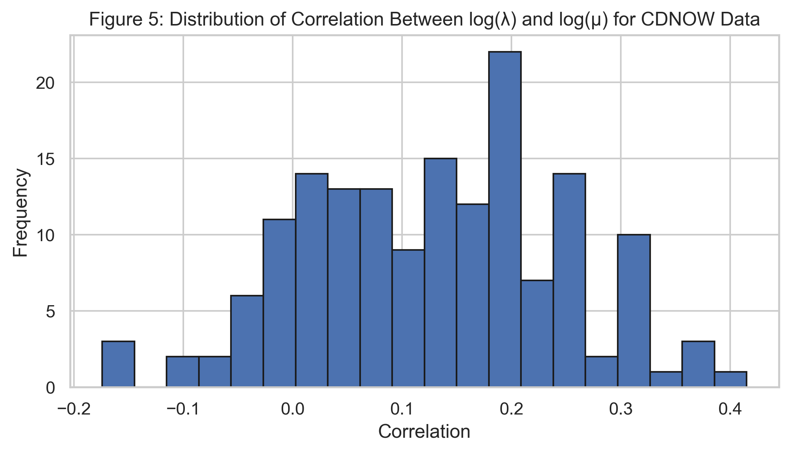
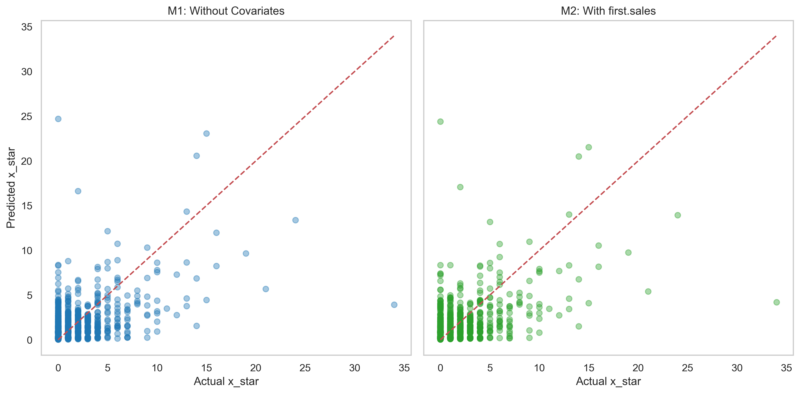
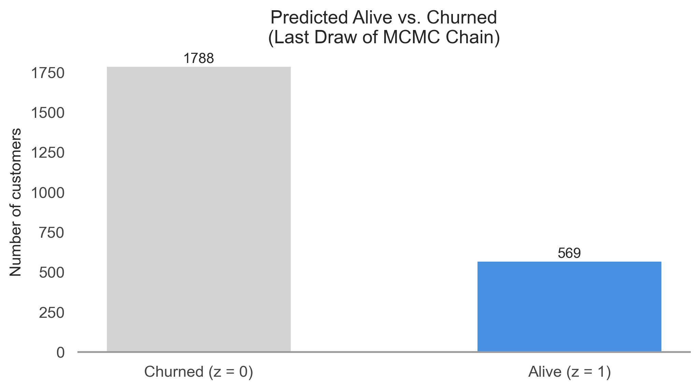

# Abe (2009) Pareto/NBD Model Implementation

This repository contains a Python implementation of the hierarchical Bayesian Pareto/NBD model from Abe (2009) applied to the CDNOW dataset. It covers model estimation, customer-level forecasts, and evaluation of model fit and predictive accuracy, reproducing Tables 1–4 from the original paper.

## Repository Structure

```
Abe_2009_model_implementation/
├── Data/
│   └── cdnowElog.csv         # Raw CDNOW transaction log
├── Models/
│   ├── pareto_abe_manual.py  # MCMC routines for hierarchical Bayesian estimation
│   └── elog2cbs.py           # Utility to convert event log to CBS format
├── Estimation/
│   └── estimation_results.xlsx  # Generated tables (Tables 1–4)
├── abe_python_validation.py   # Main script to estimate models, compute Tables 1–4, and evaluate fit
├── abe_python_validation.ipynb # Jupyter notebook with interactive cells
├── README.md                  # This file
└── .gitignore                 # Ignore Python cache, output files, etc.
```

## Prerequisites

- Python 3.8 or higher  
- Required packages:  
  ```bash
  pip install numpy pandas scipy matplotlib seaborn jupyter openpyxl
  ```

## Usage

1. **Convert CDNOW log to CBS format**  
   ```bash
   python Models/elog2cbs.py Data/cdnowElog.csv --output Data/cdnow_cbs.csv
   ```

2. **Run the validation script**  
   ```bash
   python abe_python_validation.py
   ```
   This will:
   - Estimate two hierarchical Bayesian models (M1 without covariates, M2 with a sales covariate)
   - Generate Tables 1–4 (saved to `Estimation/estimation_results.xlsx`)
   - Produce evaluation metrics (disaggregate correlation, MSE; aggregate time-series MAPE)

3. **Interactive exploration**  
   Launch the notebook:
   ```bash
   jupyter notebook abe_python_validation.ipynb
   ```


## Results

- **Table 1**: Descriptive statistics of CDNOW customers  
- **Table 2**: Model fit metrics (correlation, MSE, MAPE) for calibration and validation  
- **Table 3**: Parameter estimates for M1 and M2 with credible intervals  
- **Table 4**: Customer-level posterior summaries (expected lifetime, survival probability, forecasted transactions)

## Figures

### Figure 2: Weekly Time-Series Tracking for CDNOW Data


### Figure 3: Conditional Expectation of Future Transactions


### Figure 4: Scatter Plot of Posterior Means of λ and μ


### Figure 5: Distribution of log(λ)–log(μ) Correlations


### Scatter: Actual vs. Predicted x_star (M1 vs. M2)


### Predicted Alive vs. Churned Customers



## Contact

For questions or contributions, please open an issue or submit a pull request.  